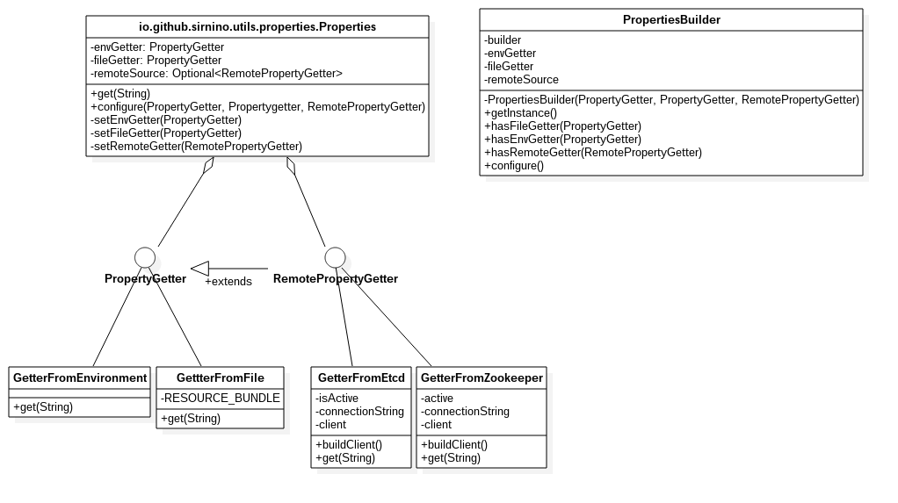

.. _classdiagram:

Class Diagram
==================

The *src/main* folder contains the source code of PropertyManager.

The project is composed by two packages: 

- io.github.sirnino.utils.properties
- io.github.sirnino.utils.properties.getters

PropertyManager is packaged through `Maven <https://maven.apache.org/>`_.